---
title:
- Digital Electronics 101
subtitle:
- An introductory course on Electronics, C++ and Arduino-like platforms
author:
- J. Rodrigues
- R. Antunes
institute:
- HackerSchool
fonttheme:
- "professionalfonts"
monofont:
- "Source Code"
theme:
- CambridgeUS
colortheme:
- beaver
---

## What are Electronics?

# Fundamental Notions and Laws in Electronics
There are three main notions to be understood in electronics:
	
+ **Current aka I** (SI: Ampere): The ordered flow of electrons, therefore electrical charge per time unit 
	
+ **Electrical Tension or Potential Difference aka U** (SI: Volt): The tension applied on said electrons, therefore energy per charge
	
+ **Resistance aka R** (SI: Ohm): The resistance of a medium to the electron flow


# Ohm's Law
We can describe the resistance as the tension we have to "apply" to push the electron flow establishing an equality-**Ohm's Law:**
$$ R=\frac{U}{I} $$

Or in a funnier way:

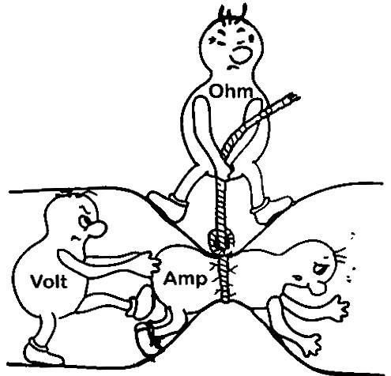{height=145px}

# Kirchhoff's Voltage Law
*The sum of all potential diferences in a loop is zero!*

{height=200px}

# Kirchhoff's Current Law
*There can be no residual current in a node!*

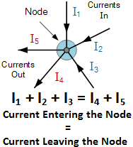{height=200px}

# Additional Notions and Fundamentals
Then we can also add some additional notions
	
+ **Power**(SI: Watt): Rate of transference of electrical energy through a circuit, using the definition of Electrical Tension and current:
	$$ P=U \times I $$

# Breadboards and PCBs I
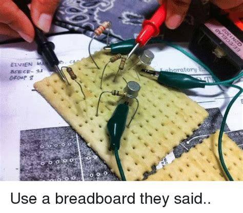{height=200px}

# Breadboards and PCBs II
{height=200px}

# Breadboards and PCBs III
After testing our circuit in a breadboard, we might have a very complex and not portable weave of wires and components...

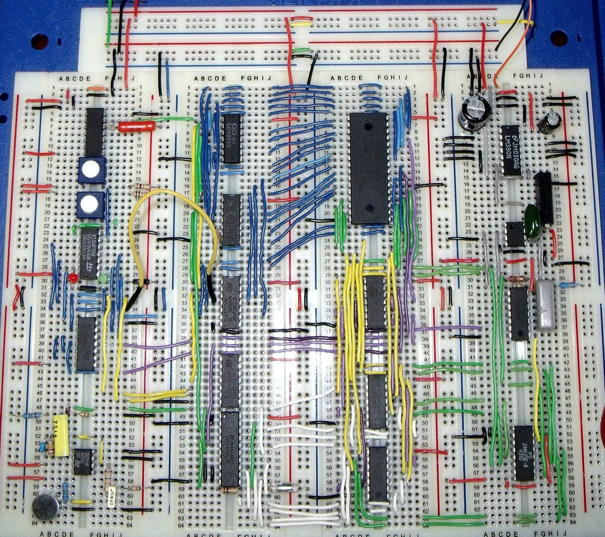{height=60px}

We can then use some software tools (like KiCAD) to help us create a PCB schematic.After that we can send it to a manufacturer or do it ourselves!

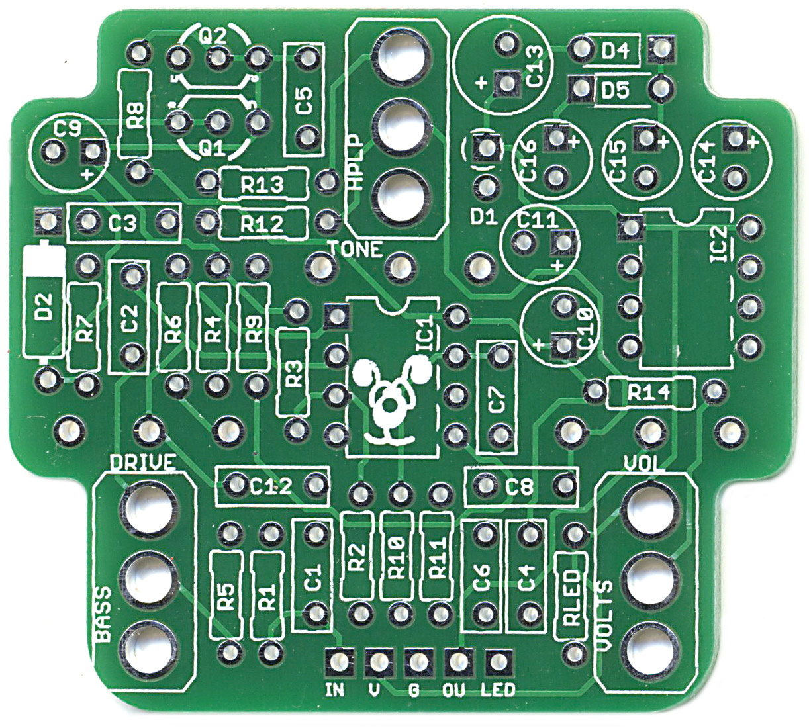{height=60px}

# Power sources
The most fundamental devices are power sources.
They supply (active component) a given tension to our circuit through the conversion of an $\mathrm{x}$ type of energy (chemical, mechanical, etc.) into electrical energy.

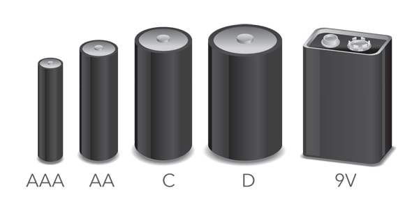{height=100px}

# Resistors
Another fundamental component.
Depending on the resistor type they introduce a fixed or variable resistance (R) into our circuits. They are unpolarized.

{height=60px}

{height=60px}

# Resistors II

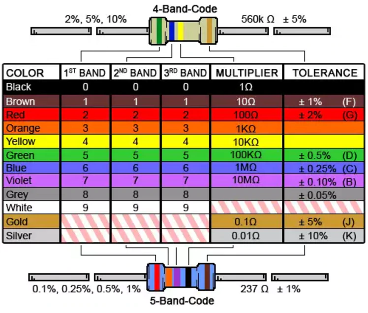{height=200px}

# Toggle Components
They toggle the loop where they are placed, opening or closing said loop.

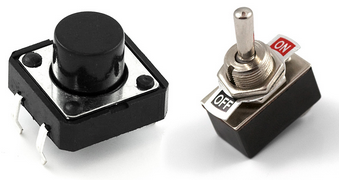{height=145px}


# Capacitors in a DC circuit

Capacitors are components with relevant capacitance.

+ **Capacitance**(SI: Farad): The ability of a material to store electrical charge. In a DC circuit:
	$$ C=\frac{q}{U} $$

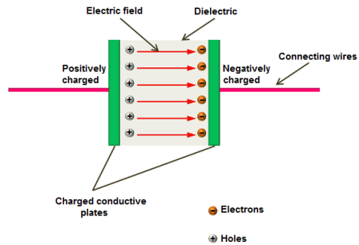{height=100px}

Why is this relevant?....

# A pratical example - the RC circuit
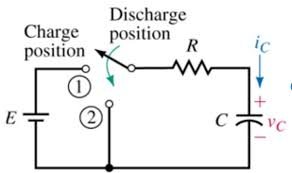{height=80px}

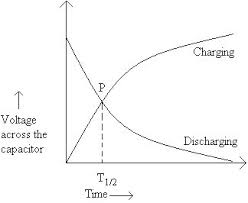{height=80px}

And capacitors have many more appliances such as filtering, shielding, etc.

# Diodes
Diodes are components that limit the flow of electrical current in a single orientation. Nowadays most diodes are composed of semiconductors in a p-n junction, which is also the material basis for another important component, the **transistor**.

{height=100px}

Diodes have a limited use in DC circuits, however we can use them to protect other components from inverted polarity, to construct diode logic gates, etc., or...

# LEDs
Arguably the most used diodes in DC circuits.

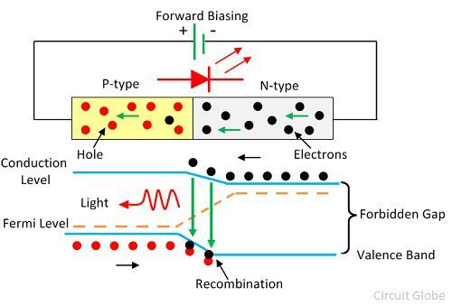{height=200px}

# Integrated Circuits
Integrated circuits have a miriad of functions from amp-ops, to integrated diodes, to timers and even logic gates.
They are composed of tiny MOSFE transistors.

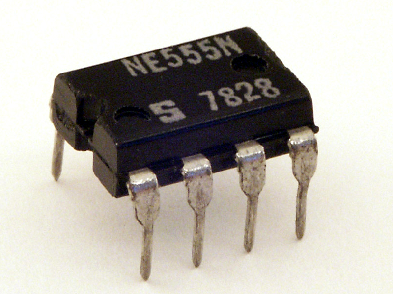{height=25px}

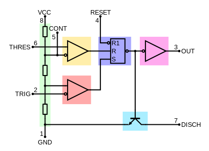{height=100px}

# Integrated Circuits II

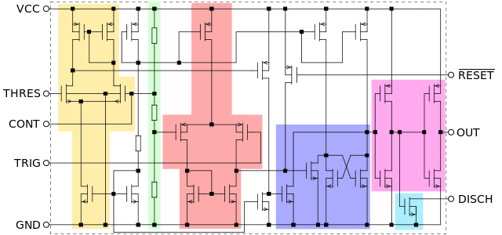{height=200px}

# Arduino
Arduino boards are microcontrollers under a CC-BY-SA license.

They allow the integration of digital and analogic control, UART bus communication, etc.  into electronic circuits, expanding their potential.

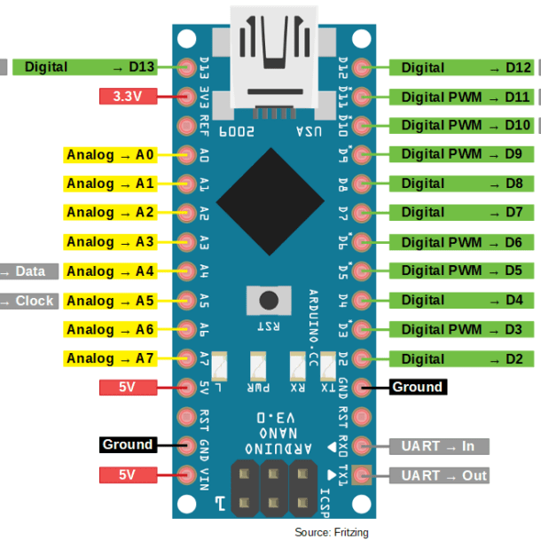{height=150px}

# Arduino IDE
The Arduino IDE, is an integrated development enviroment under LGPL.

It allows serial communication with a Arduino board, compilation of .ino files (based on C++) and flashing of said binaries into a Arduino Board.
Recently a 2.0 version of the IDE has been released.

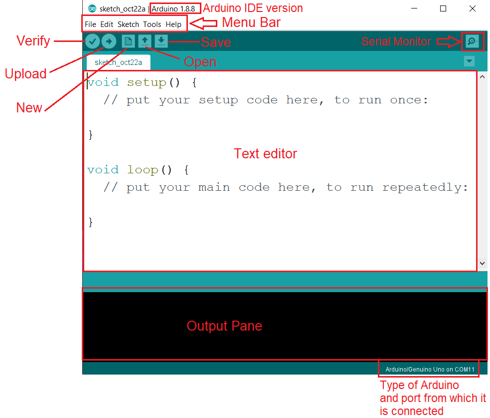{height=140px}

# C++ vs Python
- C++ is compiled, while Python is interpreted.
- Statements end with a semicolon (;), brackets are used to define block of code,
instead of indentation.
- Variables are statically typed, instead of dynamically typed.
- Lower level, closer to the hardware, allows for more control.

# Variables
## Python
```py
foo = 1
bar = 3.1415 # sample text
baz = True
```

## C++
```cpp
int foo = 1;
float bar = 3.1415; // sample text
bool baz = true;
```

# Functions
## Python
```py
def add(a, b):
	return a + b
```

## C++
```cpp
int add(int a, int b) {
	return a + b;
}
```

# Conditional Statements
## Python
```py
if bar > 0:
	return bar
elif bar < 0:
	return -bar
else:
	return 0
```

## C++
```cpp
if (bar > 0) {
	return bar;
} else if (bar < 0) {
	return -bar;
} else {
	return 0;
}
```

# While Loops
## Python
```py
foo = 0
while foo < 10:
	foo += 1
	# do something
```

## C++
```cpp
int foo = 0;
while (foo < 10) {
	foo += 1;
	// do something
}
```

# For Loops
## Python
```py
for foo in range(10):
	# do something
```

## C++
```cpp
for (int foo = 0; foo < 10; foo += 1) {
	// do something
}
```

# Controlling your Arduino with C++

## Program Structure

```cpp
void setup() {
	// code here runs once, when the board is powered on
}

void loop() {
	// code here runs repeatedly, forever
}
```

# Serial

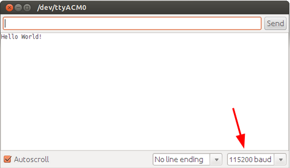{height=100px}

```cpp
void setup() {
	Serial.begin(9600);
}

void loop() {
	Serial.println("Hello World!");
}
```

# Delay

```cpp
int secondsElapsed;

void setup() {
	Serial.begin(9600);
	secondsElapsed = 0; // start at 0
}

void loop() {
	Serial.print(secondsElapsed);
	Serial.println(" seconds have passed");
	secondsElapsed += 1;
	delay(1000); // wait for a second before repeating
}
```

---

{height=100px}

```
0 seconds have passed
1 seconds have passed
2 seconds have passed
3 seconds have passed
4 seconds have passed
5 seconds have passed
(...)
```

# IO functions

- `pinMode(pin, mode)`: sets the mode of a pin to either `INPUT` or `OUTPUT`.
- `digitalWrite(pin, value)`: sets the value of a pin to either `HIGH` or `LOW`.
- `digitalRead(pin)`: returns the value of a pin, either `HIGH` or `LOW`.
- `analogWrite(pin, value)`: sets the value of a pin to a value between 0 and 255.
- `analogRead(pin)`: returns the value of a pin, between 0 and 1023.

# LED Blink

```cpp
void setup() {
	pinMode(13, OUTPUT); // set pin 13 as output
}

void loop() {
	digitalWrite(13, HIGH); // turn on the LED
	delay(1000); // wait for a second
	digitalWrite(13, LOW); // turn off the LED
	delay(1000); // wait for a second
}
```

# Button

```cpp
void setup() {
	pinMode(2, INPUT); // set pin 2 as input
	Serial.begin(9600);
}

void loop() {
	if (digitalRead(2) == HIGH) {
		Serial.println("Button pressed");
	}
}
```

# Project

