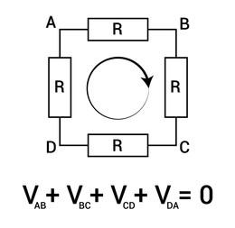

---
title:
- Digital Electronics 101
subtitle:
- An introductory course on Electronics, C++ and Arduino-like platforms
author:
- J. Rodrigues
- R. Antunes
institute:
- HackerSchool
fonttheme:
- "professionalfonts"
monofont:
- "Source Code"
theme:
- CambridgeUS
colortheme:
- beaver
---

# What are Electronics?

# Fundamental Notions and Laws in Electronics
There are three main notions to be understood in electronics:
	
+ **Current aka I** (SI: Ampere): The ordered flow of electrons, therefore electrical charge per time unit 
	
+ **Electrical Tension or Potential Difference aka U** (SI: Volt): The tension applied on said electrons, therefore energy per charge
	
+ **Resistance aka R** (SI: Ohm): The resistance of a medium to the electron flow

# Ohm's Law
We can describe the resistance as the tension we have to "apply" to push the electron flow establishing an equality-**Ohm's Law:**
$$ R=\frac{U}{I} $$

Or in a funnier way:

{height=145px}

# Kirchhoff's Voltage Law
*The sum of all electrical tensions in a loop*

{height=200px}

# Kirchhoff's Current Law
*There can be no residual current in a node!*

{height=200px}

# Additional Notions and Fundamentals
Then we can also add some additional notions
	
+ **Power**(SI: Watt): Rate of transference of electrical energy through a circuit, using the definition of Electrical Tension and current:
	$$ P=U \times I $$

+ **Capacitance**(SI: Farad): The ability of a material to store electrical charge. In a DC circuit:
	$$ C=\frac{q}{U} $$

# Electrical Components

# Breadboards and PCBs I
{height=200px}

# Breadboards and PCBs II
{height=200px}

# Breadboards and PCBs III
After testing our circuit in a breadboard, we might have a very complex and not portable weave of wires and components...

{height=60px}

We can then use some software tools (like KiCAD) to help us create a PCB schematic.After that we can send it to a manufacturer or do it ourselves!

{height=60px}

# Power sources

# Resistors

# Toggle Components

# Capacitors in a DC circuit

# Diodes

# LEDs

# Transistors 101

# Arduino

# Schematic

# Arduino IDE

# Controlling your Arduino with C++
